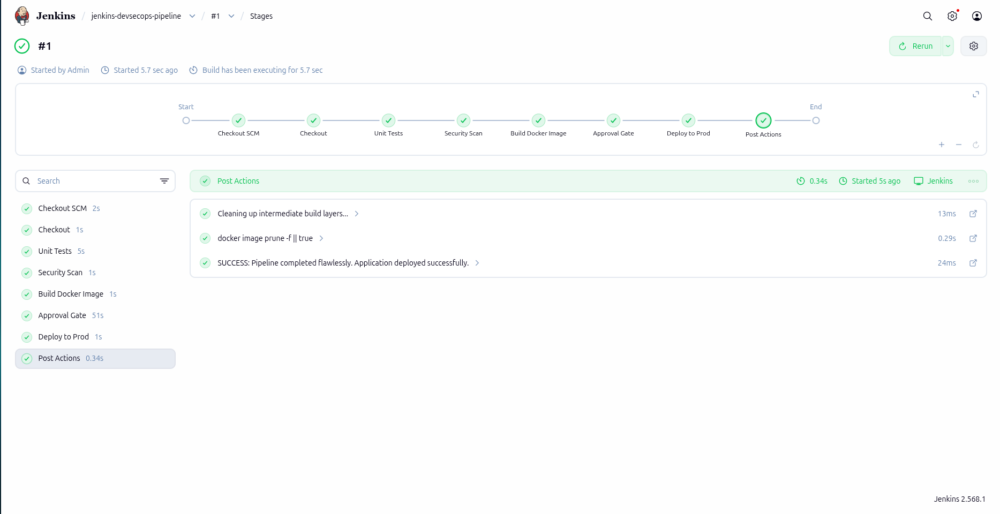
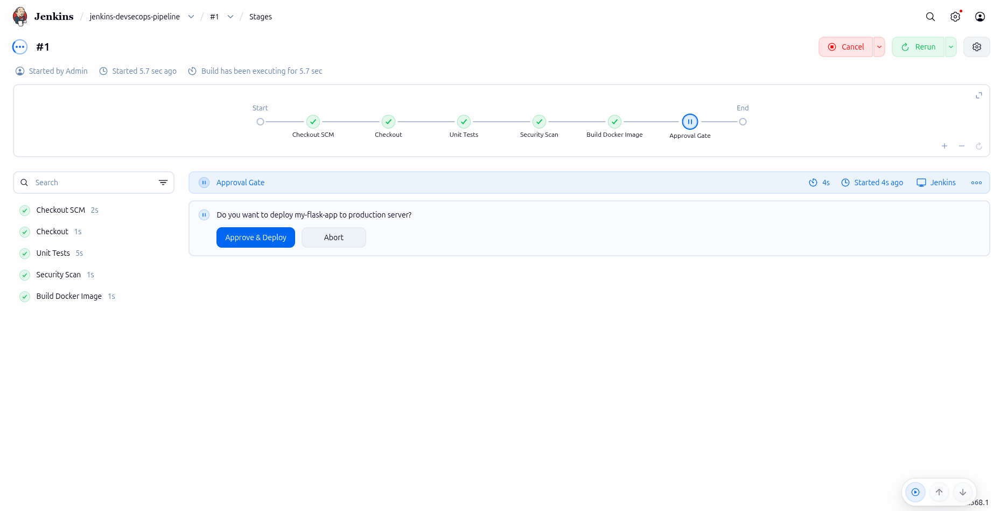

# Jenkins DevSecOps Pipeline

A fully automated DevSecOps CI/CD pipeline built with Jenkins. Every push to the repository triggers a pipeline that scans the code for security vulnerabilities, runs the test suite, builds a Docker image, waits for manual approval, and deploys the application — all defined as code in a Jenkinsfile.

## Pipeline Stages

```
Checkout → Unit Tests → Security Scan → Build Image → Approval Gate → Deploy → Post Actions
```

| Stage | Tool | What it does |
|---|---|---|
| Checkout | Git | Pulls latest code from GitHub |
| Unit Tests | Pytest | Builds a test image and runs the test suite |
| Security Scan | Bandit | Static analysis scan for Python security vulnerabilities |
| Build Docker Image | Docker | Builds the production image |
| Approval Gate | Jenkins Input | Pauses pipeline and waits for manual approval before deploying |
| Deploy to Prod | Docker | Removes old container and runs the new image |
| Post Actions | Docker | Cleans up dangling image layers |

## Screenshots

### Full Pipeline — All Stages Green


### Approval Gate — Manual Control Before Production


## Stack

- **Jenkins** — CI/CD server running in Docker
- **Flask** — simple Python web app used as the deployment target
- **Pytest** — unit testing framework
- **Bandit** — Python SAST security scanner
- **Docker** — containerization and deployment

## Project Structure

```
jenkins-devsecops-pipeline/
├── app/
│   ├── app.py              # Flask web app
│   ├── test_app.py         # Pytest unit tests
│   ├── requirements.txt    # Python dependencies (Flask, Pytest, Bandit)
│   └── Dockerfile          # App container definition
├── docker-compose.yml      # Runs the Jenkins server
├── Dockerfile              # Custom Jenkins image with Docker CLI
├── Jenkinsfile             # Pipeline definition
└── README.md
```

## How to Run

**1. Clone the repo**
```bash
git clone https://github.com/ahmed-m-miqdad/jenkins-devsecops-pipeline.git
cd jenkins-devsecops-pipeline
```

**2. Start Jenkins**
```bash
docker compose up -d
```

**3. Get the initial admin password**
```bash
docker exec jenkins-server cat /var/jenkins_home/secrets/initialAdminPassword
```

**4. Open Jenkins**
```
http://localhost:8080
```
- Paste the admin password
- Install suggested plugins
- Create your admin user

**5. Create the pipeline**
- New Item → Pipeline
- Pipeline script from SCM → Git
- Repository URL: `https://github.com/ahmed-m-miqdad/jenkins-devsecops-pipeline`
- Branch: `*/main`
- Script Path: `Jenkinsfile`
- Save → Build Now

## Triggering the Pipeline

By default the pipeline runs manually via **Build Now** in the Jenkins UI. In production you would trigger it automatically on every push using one of these two approaches:

**Option 1 — GitHub Webhook (recommended for production)**

Requires Jenkins to be publicly accessible. You can use ngrok for local testing:
```bash
ngrok http 8080
```
Then in your GitHub repo go to Settings → Webhooks → Add webhook:
- Payload URL: `https://your-ngrok-url/github-webhook/`
- Content type: `application/json`
- Trigger: Just the push event

And in Jenkins pipeline settings enable **GitHub hook trigger for GITScm polling**.

**Option 2 — Poll SCM (no public URL needed)**

Add this to your Jenkinsfile inside the `pipeline` block:
```groovy
triggers {
    pollSCM('* * * * *') 
}
```
Not instant but works without exposing Jenkins publicly — good for local development.

## Pipeline Environment Variables

Defined at the top of the Jenkinsfile:

| Variable | Value | Description |
|---|---|---|
| `APP_NAME` | `my-flask-app` | Container name for deployment |
| `IMAGE_NAME` | `local-app/my-flask-app:latest` | Docker image tag |
| `PORT` | `5000` | Port the app listens on |

## Security Scan Results

Bandit scans all Python files and reports issues by severity. The pipeline uses `|| true` to report findings without blocking — in production you would set a threshold to fail the build on high severity issues.

## Requirements

- Docker
- Docker Compose

## Author

Ahmed M Miqdad — [github.com/ahmed-m-miqdad](https://github.com/ahmed-m-miqdad)